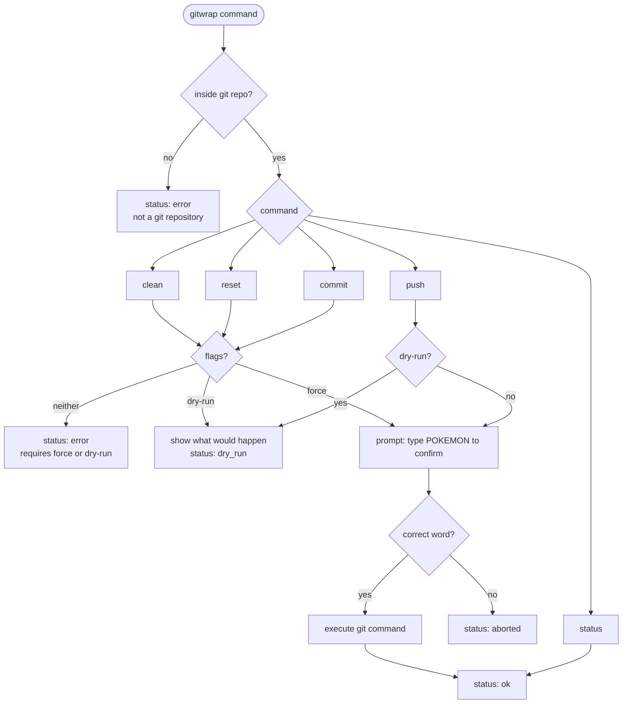
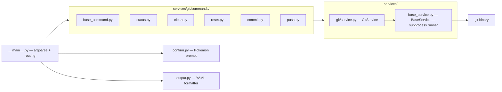

# gitwrap

A safer git CLI wrapper with dry-run support, Pokemon confirmation prompts, and machine-readable YAML output.

## Requirements

- Python 3.9+
- git installed and available on your PATH

## Installation

See [INSTALL.md](INSTALL.md) for full setup instructions.

## Usage

`gitwrap` must be run from inside a git repository. All output is YAML.

---

### status
    
Show branch, unpushed commits with files changed, and working tree state.

```bash
gitwrap status
```

```yaml
command: status
status: ok
branch: main
unpushed: 1
unpulled: 0
local_commits:
  - hash: aebb3e5
    message: add feature
    files:
      - path: src/main.py
        state: modified
working_tree:
  clean: false
  files:
    - path: notes.txt
      state: untracked
staged_files:
  - src/app.js
unstaged_files:
  - README.md
untracked_files:
  - notes.txt
```

`staged_files`, `unstaged_files`, and `untracked_files` are omitted when empty.

**State values:** `added` `modified` `deleted` `renamed` `untracked`

---

### clean

Remove untracked files. Requires `--dry-run`, `--force`, or `--yes`.

```bash
gitwrap clean --dry-run   # show files that would be removed
gitwrap clean --force     # confirm with Pokemon word, then delete
gitwrap clean --yes       # alias for --force
```

```yaml
command: clean
status: dry_run
files:
  - temp.log
  - build/output.js
message: 2 file(s) would be removed
```

---

### reset

Reset tracked files to HEAD. Requires `--dry-run` or `--force`.

```bash
gitwrap reset --dry-run   # show files that would be reset
gitwrap reset --force     # confirm with Pokemon word, then reset
```

```yaml
command: reset
status: dry_run
files:
  - path: src/main.py
    state: M
message: 1 file(s) would be reset to HEAD
```

---

### commit

Stage all changes (`git add .`) and commit. Requires `-m` and either `--dry-run` or `--force`.

```bash
gitwrap commit -m "your message" --dry-run   # show what would be staged and committed
gitwrap commit -m "your message" --force     # confirm with Pokemon word, then stage and commit
```

```yaml
command: commit
status: ok
message: your message
output: '[main abc1234] your message'
```

---

### push

Push to remote. Always requires Pokemon confirmation unless `--dry-run`.

```bash
gitwrap push              # confirm with Pokemon word, then push
gitwrap push --dry-run    # simulate push without sending anything
gitwrap push --force      # confirm with Pokemon word, then force push
```

```yaml
command: push
status: ok
message: Everything up-to-date
```

---

## Confirmation prompt

All destructive commands (`clean --force`, `reset --force`, `commit --force`, `push`) require typing a randomly chosen legendary Pokemon name before executing.

```
Push to remote — type 'RAYQUAZA' to confirm: _
```

Type it wrong → `status: aborted`, nothing happens. `--dry-run` always skips the prompt.

**Pokemon pool — Gen 1:** articuno, zapdos, moltres, mewtwo, mew

**Gen 2:** lugia, hooh, raikou, entei, suicune, celebi

**Gen 3:** kyogre, groudon, rayquaza, latios, latias, regice, regirock, registeel, jirachi, deoxys

---

## Command flow



---

## Architecture



Adding a new command: subclass `BaseCommand` in `services/git/commands/`, register in `__main__.py`.

Adding a new service (e.g. docker): subclass `BaseService` in `services/docker/`, wire up a `build_docker_parser()` in `__main__.py`, and add a `dockerwrap` entry point in `pyproject.toml`. The binary name determines which service is loaded — `gitwrap` → git, `dockerwrap` → docker, `kubewrap` → kubectl.

---

## Error output

All errors return YAML with `status: error` and exit code 1:

```yaml
command: null
status: error
message: not inside a git repository
```

## Exit codes

| Code | Meaning |
|------|---------|
| 0 | success or dry_run |
| 1 | error or aborted |

## Running tests

```bash
pytest tests/unit/ -v
```
